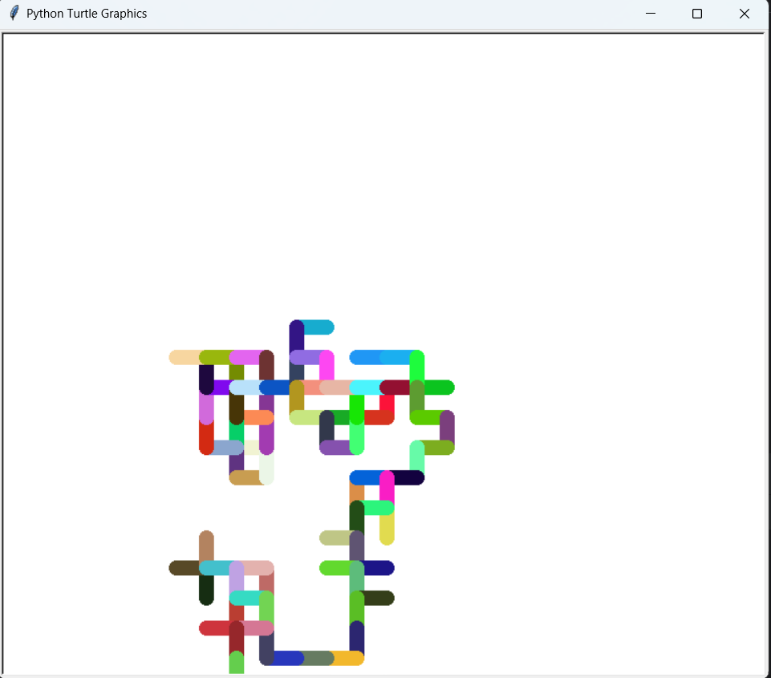

# 🎨 Turtle Graphics Fun

A colorful and creative Python project that utilizes Turtle Graphics to draw random color paths and a spirograph! This project showcases two scripts: one for random movement in different directions with vibrant colors and another for generating a mesmerizing spirograph pattern.

---

## 📜 Project Overview

This project includes:
1. **Random Color Walk** (in `main.py`): A turtle that moves randomly on the screen, changing colors and directions.
2. **Spirograph** (in `spiro.py`): A beautiful spirograph generated by looping a turtle in a circle with random colors.

### 🎨 Features

- Uses Python's Turtle Graphics and `random` libraries.
- Draws randomly colored patterns on the screen.
- Creates a spirograph with adjustable settings for unique designs.

---

## 📂 Project Files

| File           | Description                                                             |
|----------------|-------------------------------------------------------------------------|
| **main.py**    | Controls the random color movement, generating a colorful walk pattern. |
| **spiro.py**   | Draws a spirograph with random colors for a stunning visual effect.     |
| **images/**    | Contains project screenshots.                                           |

---

## 🛠️ Requirements

- **Python 3.x**
- **Turtle Graphics** (pre-installed with Python)

---

## 🚀 Getting Started

1. **Clone the repository**:
   ```bash
   git clone https://github.com/shrutimsontakke/turtle-graphics-fun.git
   ```
   
2. **Navigate to the project folder**:
   ```bash
   cd turtle-graphics-fun
   ```
   
3. **Run the scripts**:
   - **Random Walk**: 
     ```bash
     python main.py
     ```
   - **Spirograph**:
     ```bash
     python spiro.py
     ```

---

## 📸 Screenshots



---

## 🤝 Contributing

Contributions are welcome! If you have ideas for additional patterns or designs, fork this repository, make your changes, and create a pull request. Let’s make some art together!

---


